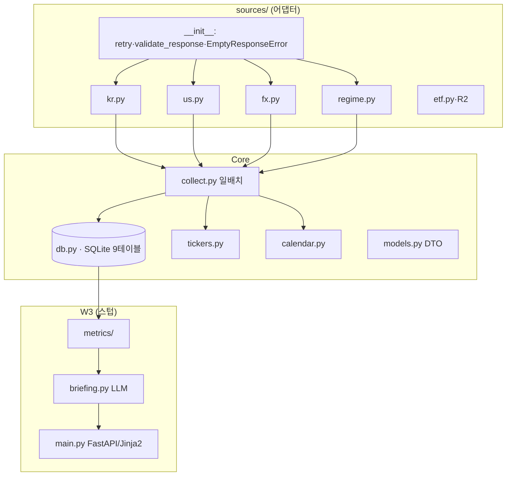

# CLAUDE.md — Ballast (BAL)

## Project Overview
FastAPI (Python) — AI 투자 브리핑 웹서비스. 한국/해외 시장 데이터(pykrx·DART·yfinance·FMP·SEC 등)를 수집해 LLM으로 일일 브리핑을 생성한다. **응답은 한국어로 해주세요.**

## Architecture



### Domain Modules
| Module | 책임 |
|--------|------|
| `app/sources/` | 외부 무료 데이터 어댑터(Protocol, 종목 격리) |
| `app/collect.py` | 일배치 — 수집·적재·collect_run 게이트 |
| `app/db.py` | SQLite 연결/스키마/조회·적재 헬퍼 |
| `app/tickers.py`·`calendar.py` | 티커 정규화 · 거래일(XKRX/XNYS) |
| `app/models.py` | frozen DTO (OHLCV·Funda·Headline·RegimeRow·FxRate) |
| `app/metrics/`·`briefing.py`·`main.py` | 계산·LLM·웹 (W3, 스텁) |

## Commands
```bash
source .venv/bin/activate
uvicorn app.main:app --host 127.0.0.1 --port 8000   # 127.0.0.1 전용
pytest -q                                            # 테스트 (138)
ruff check app/ tests/                               # 린트 (커밋 전)
```

## Key Rules
- **NEVER `0.0.0.0` 바인딩** — `127.0.0.1` 전용.
- **NEVER `.env` 커밋** — `.env.example`만. 시크릿은 `os.environ`. API 키는 URL/로그 노출 금지(헤더 우선).
- **NEVER `data/`를 클라우드 동기화 폴더에** — 금융정보 유출 방지.
- **NEVER 빈 응답을 OK로** — `validate_response(rows=0)`→`EmptyResponseError`. "예외 안 남 ≠ 데이터 실재".
- **NEVER fx 결측 시 분모 제외** — 산출 거부(0/NULL 위장 금지).
- **NEVER 제공자 PER/PBR 자체 재계산** — 제공자 계산값만 캐시.
- **NEVER SQL을 문자열 연결로** — `?`/named param 바인딩만(named param=컬럼 전체명).

## Git Conventions
- 커밋: `<type>(BAL-N): <설명>` (feat/fix/test/docs/chore). base/기본 브랜치 = **`master`가 아니라 `main`** (remote: github.com/bigbulgogiburger/ballast).

## Harness Engineering Integration
- `HARNESS_MODE`(`.claude/settings.local.json`, 현재 **auto**): `auto`=강제 주입+커밋 게이트 차단 / `suggest`=제안만 / `off`=비활성.
- 워크플로: /jira-plan→/harness-plan, /jira-execute Phase 후→/harness-review, /jira-commit 전 aggregate-verdict 확인.
- 에이전트: 프로젝트 `bal-*`(explorer·security-reviewer·test-writer·build-resolver) 우선.
- 아티팩트: dev-guide `docs/{KEY}-dev-guide.md` · Sprint Contract·Verdict·State `.claude/runtime/` (완료분 `archive/{EPIC}/`).

## Reference Docs
| 문서 | 참조 시점 | 경로 |
|------|----------|------|
| 모듈 맵·데이터 흐름 | 새 모듈·seam | `.claude/docs/reference/architecture.md` |
| 어댑터 패턴 | 새 소스·폴백·재시도 | `.claude/docs/reference/source-adapters.md` |
| DB 스키마·헬퍼 | 테이블·쿼리·upsert | `.claude/docs/reference/database.md` |
| 일배치 | collect·게이트·백필 | `.claude/docs/reference/data-collection.md` |
| 테스트 규약 | 테스트 추가 | `.claude/docs/reference/testing.md` |
| 설계 SoT(정본) | 요구·백엔드·DB·AI | `docs/01-product-spec.md` · `04-backend.md` · `05-database.md` · `06-ai-agent.md` |
| 마일스톤 계획 | wave·결정 | `docs/BAL-{1,2}-*-orchestration.md` · `*-decisions.md` |

> ⚠️ `TECH-DESIGN.md`는 레포에 없음 — `docs/04·05·01`이 정본.

---
Last Updated: 2026-06-03
